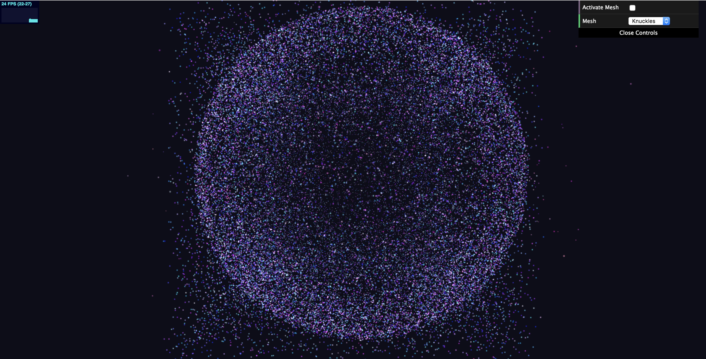

# Project 6: Particle System

# Particles

# Demo Link

https://ishanranade.github.io/ParticleWorld/

# Technical Details

## Particle collection
I created a ParticleSystem class that stored information about the particles in the scene.  I also had a Particle class that kept information about the position, velocity, acceleration, and color of a specific particle.  

## Interactive Forces

Attractor

Repeller

Oscillator

I also created an abstract Exertor class that exposed an interface for applying a force on a particle.  I implemented three types of Exertors.  An Attractor pulls particles near, a Repeller pushes them away, and an Oscillator makes them oscillate around it.  I used Euler integration to calculate the changes in attributes for each time step.  I had an array of exertors that exist in the scene, and at each update, I would would look through each particle and then each exertor, and calculate the current force exerted on this particle by all the forces in the scene.  Then with this new force, I would update the acceleration, velocity, position, and color of the particle.

## GUI

For the GUI, I added the ability to change the mesh and an activate button to activate attraction to the mesh.  If you change the mesh, be sure to uncheck and check again the Activate Mesh button if it was already checked.

The user also has the ability to place an Exertor in the scene.  Point that mouse at someplace in the scene, and press either W, E, or R.  W will place an attractor, E will place a repeller, and R will place an oscillator.  If you press Q, you can create a temporary force of your choosing at your mouse position for as long as you are holding Q.  Select the type of force you want from the GUI item Mouse Force.

## Color

I had the particles become more red as their velocity increased, signifying the kinetic energy of the particle.  It maxes out at a pure red.  When stationary, the particle is purely its base color.

## Mesh Attraction

I loaded up to meshes that you can choose to create a constellation of, Knuckles and a Spaceship.  To do the attraction, I had each particle in the scene assigned to one vertex on the mesh, and had it have its own attractor at that position.  So, every particle would only have a single attractor that it would follow, and once every particle found its attractor, the shape would look like the mesh.

## Extra Credit

For extra credit I chose to have the user able to place a custom force type at a location in the scene.  The user interface is described up in the GUI section.  The user can place up to three different types of force types.  I also added a new type of force from the base two called an oscillator, which makes the particle oscillate around a point.  It will look as though the particle zooms through the point in the opposite direction, but it will then slow and turn around and zoom back, and back and forth indefinitely.

## Warnings

My ray cast implementation is not currently working currently.  So if you zoom out too far or rotate the camera and then try to click the mouse and create a force at the mouse position, the force will not be placed where you expect.  For best results, zoom out just a little so you can see the box of particles and do not rotate the camera, unless you are done placing forces and just want to see the results or you are looking at the mesh constellation.  Also, the demo link takes about 20 seconds to load, so you may have to wait for it.
